# DevShop 🛒

O DevShop é um eCommerce FullStack desenvolvido para aprimorar conhecimentos em backend e frontend, incorporando o máximo de funcionalidades possíveis. Este projeto combina uma ampla gama de recursos para oferecer uma experiência completa de compras online, tanto para usuários quanto para administradores. Todo o projeto é responsivo.

## Índice 📚

- [Principais Recursos 📝](#principais-recursos-📝)
- [Como Utilizar 📖](#como-utilizar-📖)
- [Tecnologias Utilizadas 🚀](#tecnologias-utilizadas-🚀)
- [Instalação ⚙️](#instalação)
- [Deploy na Vercel 💻☁️](#deploy-na-vercel-💻☁️)
- [Imagens Relevantes 🖼️](#imagens-relevantes-🖼️)
  - [Página Inicial](#página-inicial)
  - [Página de Categorias](#página-de-categorias)
  - [Página de Categoria Específica](#página-de-categoria-específica)
  - [Página para Registro de Endereço](#página-para-registro-de-endereço)
  - [Página de Exibição dos Endereços Cadastrados do Usuário](#página-de-exibição-dos-endereços-cadastrados-do-usuário)
  - [Página de Confirmação de Pedido](#página-de-confirmação-de-pedido)
  - [Página de Pedidos do Usuário](#página-de-pedidos-do-usuário)
  - [Página de Produtos Salvos como Favoritos](#página-de-produtos-salvos-como-favoritos)
  - [Página de Busca](#página-de-busca)
  - [Página do Produto](#página-do-produto)
  - [Página Inicial - ADMIN Dashboard](#página-inicial---admin-dashboard)
  - [Página de Produtos - ADMIN Dashboard](#página-de-produtos---admin-dashboard)
  - [Página de Categorias - ADMIN Dashboard](#página-de-categorias---admin-dashboard)
  - [Página de Pedidos - ADMIN Dashboard](#página-de-pedidos---admin-dashboard)

## Principais Recursos 📝

- Autenticação de usuário via Google: Os usuários podem se autenticar utilizando suas contas do Google através da biblioteca next-auth.
- Interface amigável e responsiva: O DevShop é projetado para ser acessível e fácil de usar em diferentes dispositivos, proporcionando uma experiência de compra suave.
- Pesquisa de produtos: Os usuários podem buscar por produtos específicos, com a pesquisa abrangendo nome, slug e categoria dos produtos.
- Favoritos: É possível adicionar produtos aos favoritos para acessá-los facilmente mais tarde.
- Carrinho de compras: Adicione vários produtos ao carrinho, com a capacidade de salvar o estado do carrinho mesmo após atualizar a página. Os usuários também podem limpar todo o - carrinho de uma vez.
- Integração com Stripe para Pagamentos: Os usuários podem realizar pagamentos de forma segura utilizando o Stripe, que suporta múltiplos métodos de pagamento, como cartões de crédito e débito.
- Avaliações de produtos: Os usuários podem avaliar produtos após a entrega, e outras pessoas podem curtir essas avaliações para marcar como úteis.
- Gestão de endereços: Cadastre múltiplos endereços de entrega para maior conveniência.
- Admin Dashboard: Uma interface de administração robusta que permite:
  - Acompanhar o número de clientes nos últimos 30 dias.
  - Ver os últimos usuários cadastrados nas últimas 24h.
  - Visualizar o total de vendas concluídas nos últimos 30 dias.
  - Monitorar pedidos concluídos no dia atual.
  - Ver o total de pedidos concluídos nos últimos 30 dias.
  - Analisar gráficos de vendas concluídas por categorias nos últimos 30 dias.
  - Obter uma visão geral das vendas concluídas nos últimos 6 meses.
  - Gerenciar produtos, categorias e pedidos: busca, edição e remoção.

## Como Utilizar 📖

- Faça login com sua conta do Google.
- Explore os produtos disponíveis e use a barra de pesquisa para encontrar produtos específicos.
- Adicione os produtos desejados ao seu carrinho ou aos seus favoritos.
- Finalize sua compra selecionando um endereço de entrega.
- Após a entrega, avalie os produtos adquiridos e curta avaliações úteis de outros usuários.
- Gerencie seus pedidos e acompanhe o status das compras realizadas na seção "Meus Pedidos".

## Tecnologias Utilizadas 🚀

- [React](https://react.dev/): Biblioteca JavaScript utilizado para criar a interface do usuário com componentes reutilizáveis.
- [Next.js](https://nextjs.org/): Framework React para construção de aplicações web que oferece renderização do lado do servidor (SSR), geração estática (SSG), entre muitos outros recursos.
- [Next-auth](https://next-auth.js.org/): Biblioteca para autenticação de usuários com suporte ao OAuth.
- [Prisma](https://www.prisma.io/): ORM (Object-Relational Mapping) para acesso ao banco de dados.
- [Neon](https://neon.tech/): Plataforma de banco de dados e autenticação.
- [Stripe](https://stripe.com/br): Plataforma de pagamentos online, utilizada para processar pagamentos de forma segura e eficiente.
- [Tailwind CSS](https://tailwindcss.com/): Framework CSS para estilização que oferece várias classes para utilização já pré-estilizadas.
- [TypeScript](https://www.typescriptlang.org/): Linguagem de programação.
- [React Hook Form](https://react-hook-form.com/): Formulários de alto desempenho, flexíveis e extensíveis com validação fácil de usar.
- [Zod](https://zod.dev/): Validação de esquema com TypeScript em primeiro lugar com inferência de tipo estático.
- [Lucide React Icons](https://lucide.dev/): Biblioteca de ícones para React.
- [Shadcn](https://ui.shadcn.com/): Biblioteca UI de componentes reutilizáveis.
- [Date-fns](https://date-fns.org/): Biblioteca para manipulação de datas.
- [React Apex Chart](https://apexcharts.com/docs/react-charts/): Biblioteca para criação de gráficos.

## Instalação ⚙️

Para utilizar o DevShop localmente, siga estas etapas:

1. Clone este repositório.
2. Instale as dependências utilizando `npm install`.
3. Configure suas variáveis de ambiente conforme necessário.
4. Execute o aplicativo utilizando `npm run dev`.

## Deploy na Vercel 💻☁️

Este projeto está atualmente disponível online através da Vercel. Você pode acessá-lo [aqui](https://dev-shop-rho.vercel.app/). Experimente a aplicação em tempo real! Para testar pagamentos, utilize o cartão de teste fornecido pelo Stripe: 4242 4242 4242 4242.

## Imagens Relevantes 🖼️

### Página Inicial

Visão geral da página inicial do DevShop, tanto para Desktop quanto para Mobile. A página inicial é onde os usuários podem navegar pelos produtos em destaque, visualizar categorias populares e acessar rapidamente suas contas ou carrinhos de compras.

<table>
  <tr>
    <td>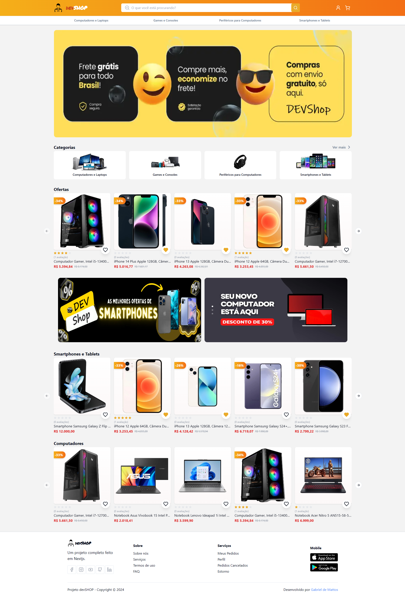</td>
    <td>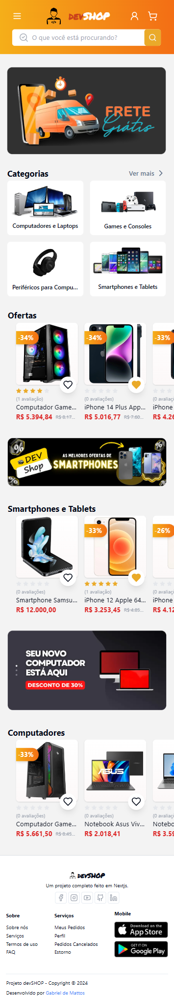</td>
  </tr>
</table>

### Página de Categorias

Visão geral da página de categorias, onde é exibida uma lista de todas as categorias disponíveis no DevShop. Os usuários podem clicar em qualquer categoria para ver os produtos correspondentes, tanto para Desktop quanto para Mobile.

<table>
  <tr>
    <td>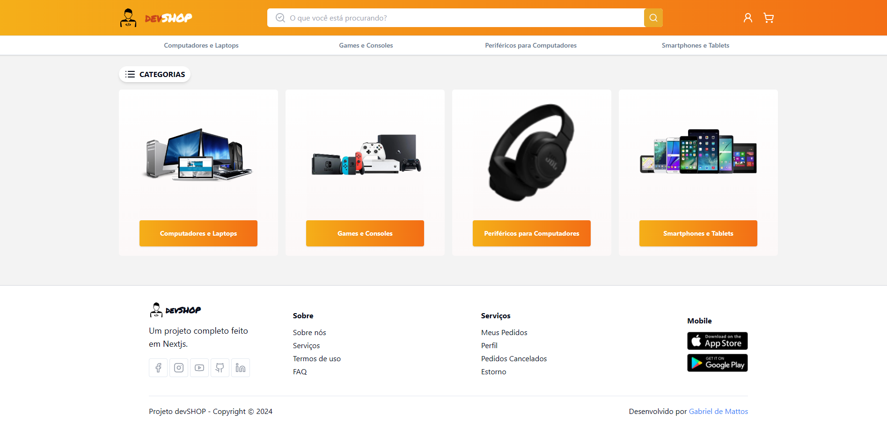</td>
    <td>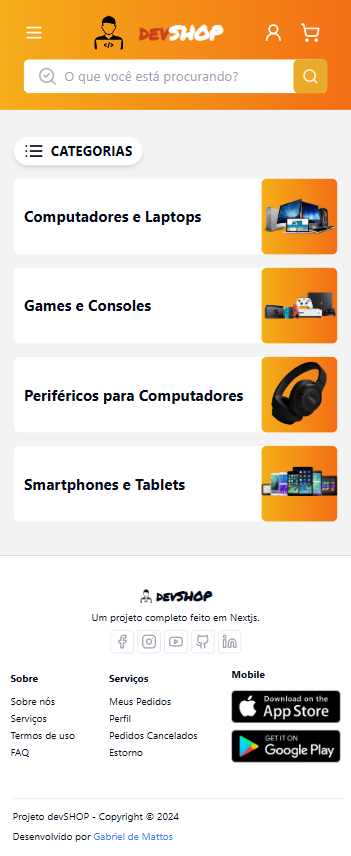</td>
  </tr>
</table>

### Página de Categoria Específica

Visão geral da página de uma categoria específica, mostrando todos os produtos relacionados à aquela categoria. Isso inclui produtos filtrados por tipo, com visualizações otimizadas tanto para Desktop quanto para Mobile.

<table>
  <tr>
    <td></td>
    <td>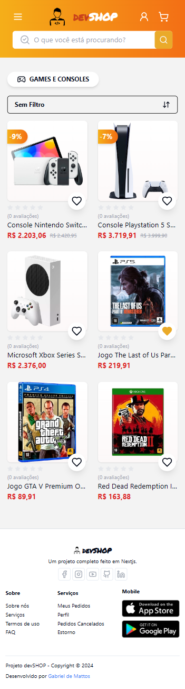</td>
  </tr>
</table>

### Página para Registro de Endereço

Nesta página, os usuários podem cadastrar novos endereços para entrega. A página permite a busca de endereço pelo CEP ou o preenchimento manual das informações.

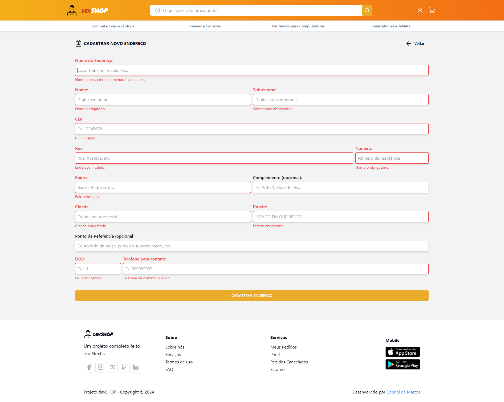

### Página de Exibição dos Endereços Cadastrados do Usuário

Aqui, os usuários podem ver todos os endereços que cadastraram. O endereço com a borda vermelha é o endereço ativo, que será usado nas entregas. Os usuários podem editar, excluir ou ativar um endereço, sendo que apenas um endereço pode estar ativo por vez.

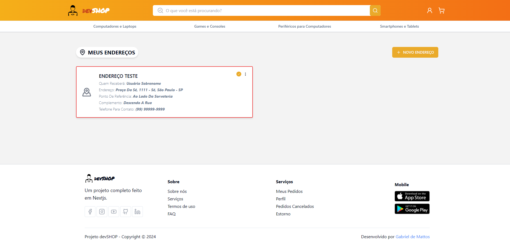

### Página de Confirmação de Pedido

Nesta página, os usuários confirmam seus pedidos, escolhendo o método de pagamento e o endereço de entrega. Se necessário, podem alterar o endereço ou adicionar um novo. Visualização disponível tanto para Desktop quanto para Mobile.

<table>
  <tr>
    <td>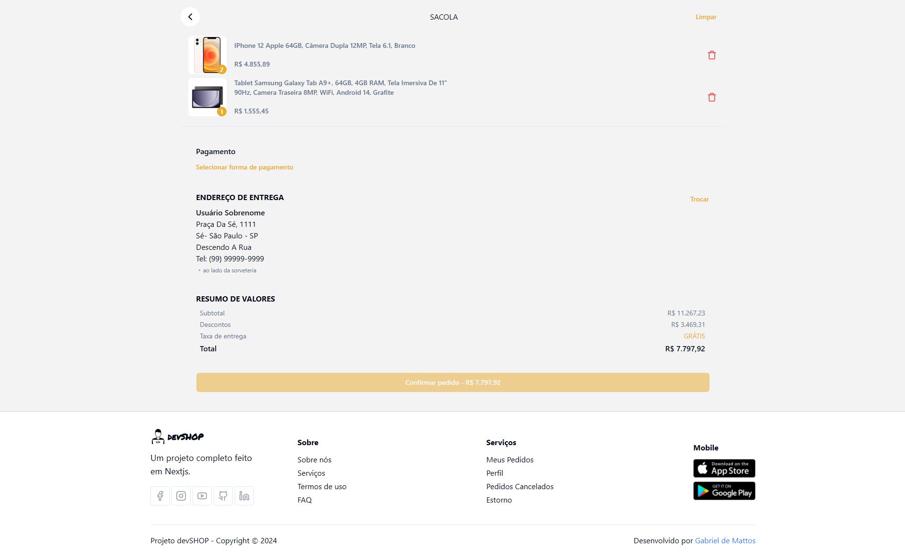</td>
    <td>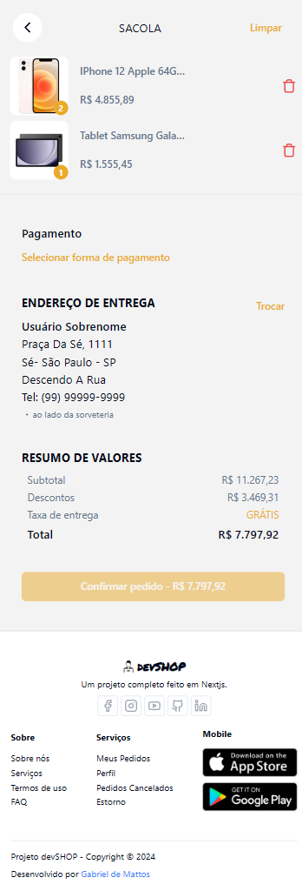</td>
  </tr>
</table>

### Página de Pedidos do Usuário

Os usuários podem verificar todos os seus pedidos, incluindo detalhes como status de entrega e itens comprados. Visualização otimizada para Desktop e Mobile.

<table>
  <tr>
    <td>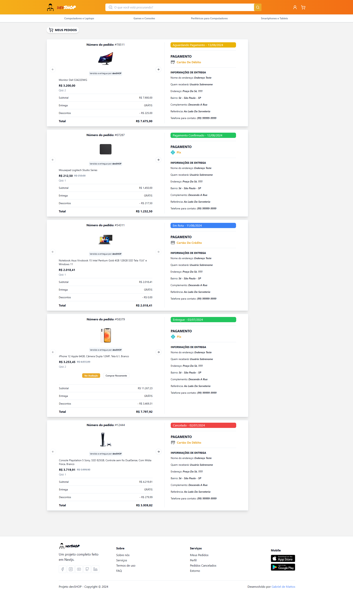</td>
    <td>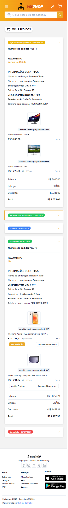</td>
  </tr>
</table>

### Página de Produtos Salvos como Favoritos

Nesta página, os usuários podem acessar rapidamente todos os produtos que marcaram como favoritos, facilitando a compra futura.

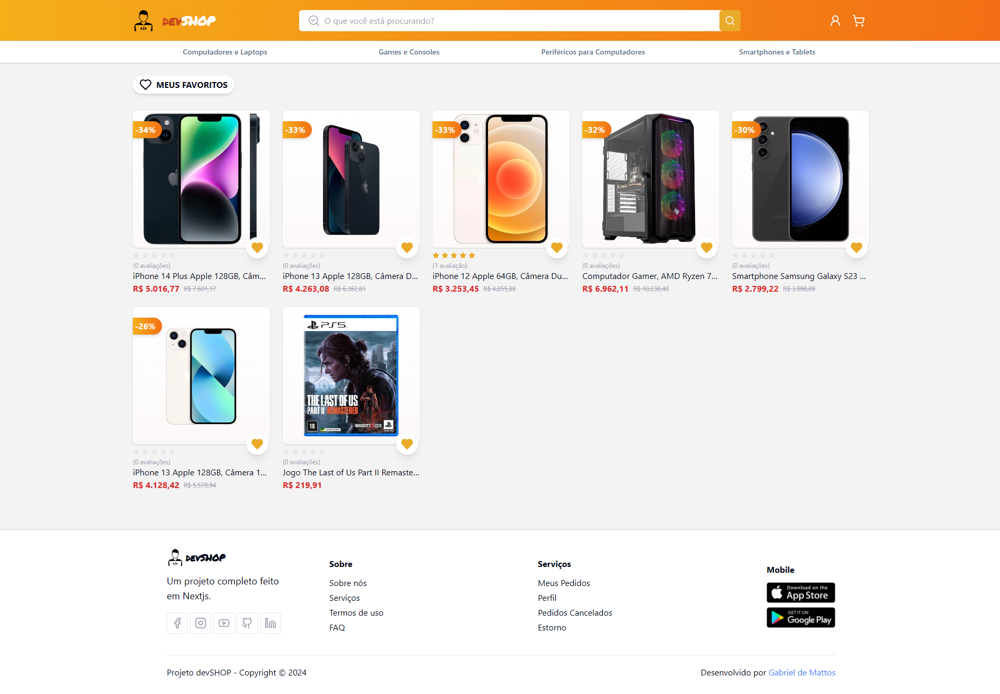

### Página de Busca

Página onde os usuários podem pesquisar por produtos, com a opção de filtrar os resultados por "Melhores Avaliados", "Maior Desconto", "Menor Preço" e "Maior Preço". A busca é essencial para encontrar produtos específicos de forma eficiente.

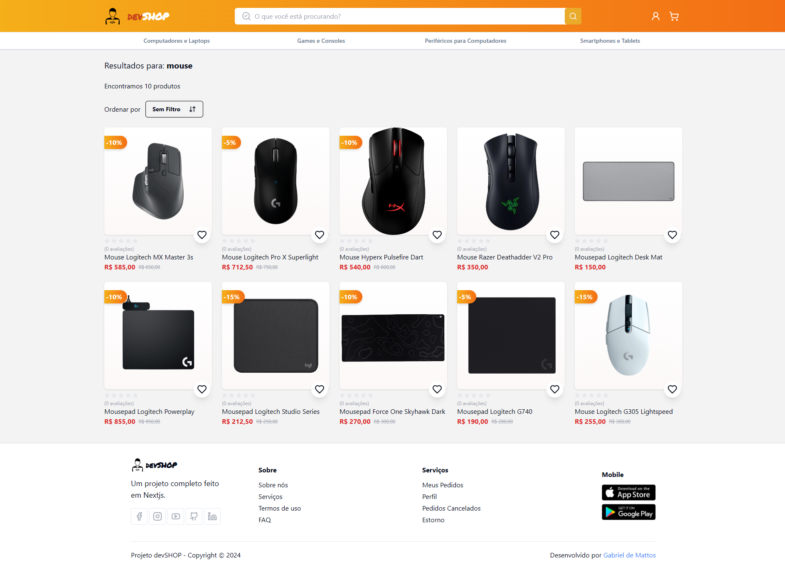

### Página do Produto

Visão geral da página de um produto específico, exibindo todas as informações relevantes, como descrição, avaliações de usuários e produtos relacionados. Disponível tanto para Desktop quanto para Mobile.

<table>
  <tr>
    <td>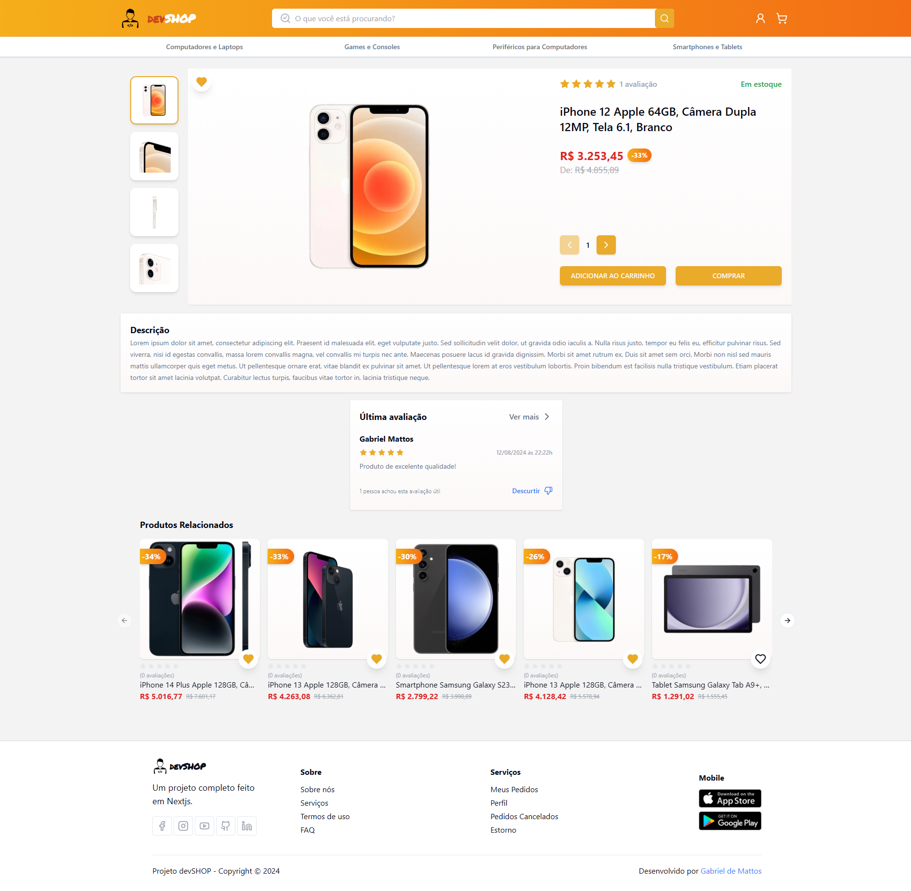</td>
    <td>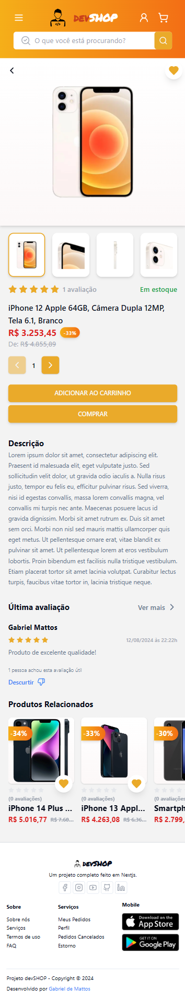</td>
  </tr>
</table>

### Página Inicial - ADMIN Dashboard

Página inicial acessível somente para administradores, oferecendo uma visão geral dos principais indicadores de desempenho do DevShop, como número de clientes, vendas e pedidos.

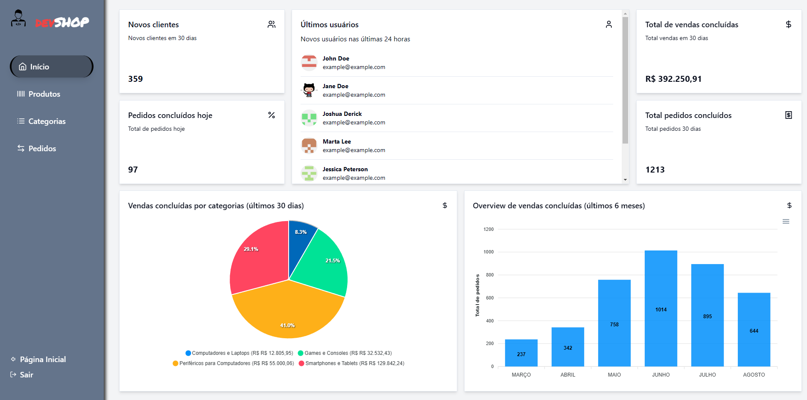

### Página de Produtos - ADMIN Dashboard

Página onde os administradores podem gerenciar todos os produtos do DevShop, com funcionalidades para editar, excluir, adicionar e buscar produtos.

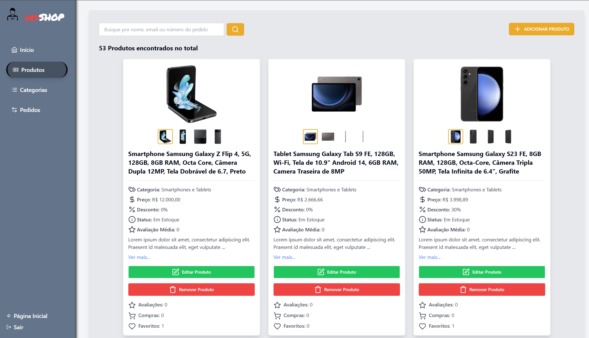

### Página de Categorias - ADMIN Dashboard

Página onde os administradores podem gerenciar as categorias do DevShop, incluindo edição, exclusão, adição e busca de categorias.

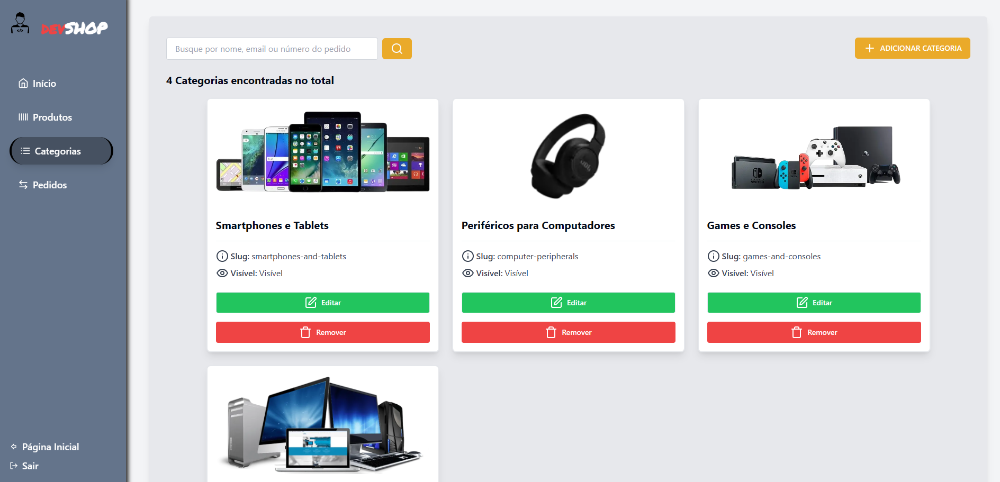

### Página de Pedidos - ADMIN Dashboard

Página onde os administradores podem buscar pedidos por número do pedido, nome do usuário ou e-mail, além de editar o status do pedido conforme necessário.

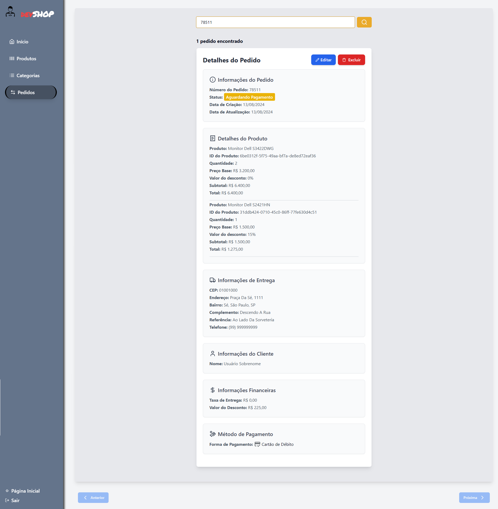
